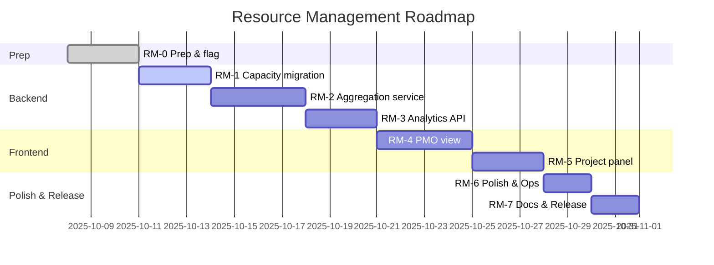
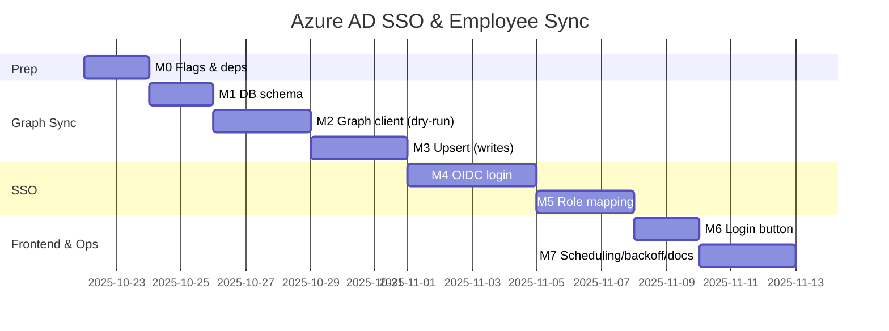

# Azure AD SSO + Employee Sync Roadmap

This document outlines goals, prerequisites, milestones, and an incremental delivery plan to add Microsoft Entra ID (Azure AD) Single Sign-On and employee synchronization via Microsoft Graph.

## Objectives
- Enable SSO with Azure AD using OpenID Connect (OIDC) Authorization Code Flow.
- Synchronize employees from Microsoft Graph into the local PostgreSQL database.
- Keep the rollout safe and incremental using feature flags and dry-run modes.

## Scope
- In-scope: Backend OIDC sign-in, Graph-based employee sync, minimal FE login button.
- Out-of-scope (initially): Full user provisioning beyond employees, SCIM, advanced RBAC UIs.

## Prerequisites

### Azure roles and access
- Can create app registrations: Application Administrator, Cloud Application Administrator, or Global Administrator.
- Can grant admin consent for Graph application permissions: Global Administrator or Privileged Role Administrator.

### App registrations (recommended: 2)
- Web/SSO app (OIDC) for user sign-in via Authorization Code Flow (+ PKCE).
- Daemon/sync app for Graph client-credentials.
- Configure redirect URIs (HTTPS) for backend callback, and enable "ID tokens" on the Web platform.
- Use a client secret or certificate (certificate preferred for daemon).

### Microsoft Graph permissions
- Application permissions (daemon sync):
  - `User.Read.All` (read users)
  - `Group.Read.All` or `GroupMember.Read.All` (if filtering by group / reading memberships)
  - Optionally `Directory.Read.All` (broader read)
- Delegated permissions (SSO):
  - `openid`, `profile`, `email`, `offline_access`
  - Optional group claims in ID token (or call `/me/memberOf` after login)

### Tenant decisions
- Single-tenant vs multi-tenant app (default: single-tenant).
- Decide on public backend base URL and redirect URI (e.g., `https://app.example.dk/api/auth/ms/callback`).
- Identity mapping strategy: primary `oid` (object id), fallback `mail`/`userPrincipalName`.
- Role mapping: via AD groups (supply GUIDs) or default local role on first sign-in.

### Infrastructure & networking
- Outbound HTTPS from backend to `login.microsoftonline.com` and `graph.microsoft.com`.
- Public HTTPS base URL for backend callback.
- Clock sync (NTP) to avoid token clock skew.

### Secrets & configuration
- Store secrets safely (Key Vault/CI secrets). Backend `.env` will include:
  - `AZURE_SSO_ENABLED=false`
  - `AZURE_TENANT_ID=`
  - `AZURE_CLIENT_ID=`
  - `AZURE_CLIENT_SECRET=` (or certificate path/config)
  - `AZURE_GRAPH_SCOPE=https://graph.microsoft.com/.default`
  - `AZURE_SYNC_PAGE_SIZE=50`
  - Optional: `AZURE_SYNC_GROUP_ID=<GUID>`
  - Optional: `AZURE_ADMIN_GROUP_ID`, `AZURE_PROJECTLEAD_GROUP_ID`

### Database additions (migration)
- Extend `employees` with:
  - `azure_ad_id text UNIQUE NULL`
  - `department text`
  - `job_title text`
  - `account_enabled boolean`
  - `synced_at timestamptz`
- Unique index on `azure_ad_id` (NULL allowed).

---

## Milestones

### Milestone 0 ? Prep & Feature Flags
- Add deps: `openid-client`, `undici` (or `node-fetch`).
- Add env flags to `.env.example` as listed above.
- Acceptance: App behaves unchanged when `AZURE_SSO_ENABLED=false`.

### Milestone 1 ? DB schema for Azure fields
- Migration adds new columns/index to `employees`.
- Acceptance: `npm run migrate` succeeds; existing data unaffected.

### Milestone 2 ? Graph client (no writes, dry-run)
- Implement `backend/scripts/lib/azure-graph.js` (client credentials):
  - Acquire token and fetch `/users` with `$select=id,displayName,mail,userPrincipalName,department,jobTitle,accountEnabled&$top={PAGE_SIZE}`.
  - Follow `@odata.nextLink` for paging.
- Add `npm run sync:azure:dry` to print a summary plan, no DB writes.
- Acceptance: Dry-run shows counts and samples; respects paging.

### Milestone 3 ? Upsert employees (idempotent)
- Add `backend/scripts/sync-azure.js` with `--dry-run` and `--limit`:
  - Match by `azure_ad_id`; fallback by lowercased email.
  - Upsert `name`, `email` (prefer `mail`, fallback `UPN`), `department`, `job_title`, `account_enabled`, `synced_at=now()`.
  - Avoid overwriting local-only fields.
- Output summary: created/updated/skipped/disabled.
- Acceptance: Second consecutive run yields zero changes; dry-run matches planned changes.

### Milestone 4 ? OIDC login flow (backend)
- Routes:
  - `GET /auth/ms/login` ? redirect to Microsoft (PKCE, `state`, `nonce`).
  - `GET /auth/ms/callback` ? validate ID token via `openid-client`.
- Mapping:
  - Find user by `azure_ad_id` or email; create local user + employee if missing.
  - Issue app JWT (keep current auth middleware).
- Feature flag controlled by `AZURE_SSO_ENABLED`.
- Acceptance: End-to-end login returns valid app JWT; first sign-in provisions/links user.

### Milestone 5 ? Role mapping (optional)
- If `AZURE_*_GROUP_ID` set, determine roles from AD groups (`groups` claim or `/me/memberOf`).
- Default new users to `Teammedlem` when no mapping match.
- Acceptance: Users in configured groups get expected roles; re-login updates role.

### Milestone 6 ? Frontend login UX (minimal)
- Add "Sign in with Microsoft" button linking to `/auth/ms/login`.
- Optional: hide local login when `AZURE_SSO_ENABLED=true`.
- Acceptance: Button completes SSO; JWT works with existing API calls.

### Milestone 7 ? Scheduling & Ops
- Add `npm run sync:azure` for writes (keep `:dry` for verification).
- Document scheduling (cron/Task Scheduler/CI) and add 429 backoff + jitter.
- Acceptance: Scheduled job completes with concise logs and safe retries.

---

## Environment variables (summary)
```
AZURE_SSO_ENABLED=false
AZURE_TENANT_ID=
AZURE_CLIENT_ID=
AZURE_CLIENT_SECRET=
AZURE_GRAPH_SCOPE=https://graph.microsoft.com/.default
AZURE_SYNC_PAGE_SIZE=50
AZURE_SYNC_GROUP_ID=
AZURE_ADMIN_GROUP_ID=
AZURE_PROJECTLEAD_GROUP_ID=
```

## Security & compliance
- Validate tokens (issuer, audience, signature, expiry). Use JWKS from discovery doc.
- Store secrets in a secure vault; rotate client secrets per policy.
- Keep `seed:admin` as break-glass if SSO is unavailable.
- Log minimally; avoid PII in logs. Redact tokens and secrets.

## Rate limits & resilience
- Implement retries with exponential backoff and jitter on Graph 429/5xx.
- Cap pages per run (`--limit`) for safe initial tests.
- Use dry-run before enabling writes.

## Testing strategy
- Unit: token validation helpers, Graph paging.
- Integration: dry-run sync against mocked Graph.
- E2E (staging): OIDC login + limited sync (`--limit 20`).
- Idempotency: two consecutive writes produce zero changes on second run.

## Rollout plan
- Dev: enable `AZURE_SSO_ENABLED` in dev only after Dry-run passes.
- Staging: test end-to-end with a subset of users/groups.
- Prod: enable sync (writes) on a schedule; enable SSO after first successful dry-run + limited write run.
- Back-out: disable `AZURE_SSO_ENABLED` and stop scheduled sync; use local admin login as fallback.

## Ops runbook (summary)
- Dry-run: `npm run sync:azure:dry`
- Write: `npm run sync:azure`
- Common failures:
  - 401/403 ? check tenant/app permissions and consent.
  - 429 ? verify backoff; reduce `AZURE_SYNC_PAGE_SIZE`.
  - Mapping conflicts ? ensure `azure_ad_id` unique; verify email fallbacks.

## Appendix: example `.env`
```
AZURE_SSO_ENABLED=false
AZURE_TENANT_ID=<tenant-guid>
AZURE_CLIENT_ID=<app-client-id>
AZURE_CLIENT_SECRET=<secret>
AZURE_GRAPH_SCOPE=https://graph.microsoft.com/.default
AZURE_SYNC_PAGE_SIZE=50
AZURE_ADMIN_GROUP_ID=
AZURE_PROJECTLEAD_GROUP_ID=
AZURE_SYNC_GROUP_ID=
```
# Resource Management Roadmap

This feature adds capacity planning and utilization views across departments and per project, with weekly aggregation and Recharts visualizations.

## Objectives
- Track capacity vs. planned vs. actual hours per week.
- PMO (org-wide, department filter) and Project Lead (project-only) views.
- Weekly aggregation using existing `week_key` dimension.
- Visualize with Recharts.

## Prerequisites
- Departments mapped to employees (assumed true). If the database lacks a `department` field, add it via migration (see dependency note).
- Confirm week aggregation: use `project_member_time_entries.week_key` (varchar(10)).
- Access control:
  - PMO view available to Administrators (or add a dedicated PMO role later).
  - Project-level view available to Projektleder and Administrator for their projects.

## Data Model
- Existing:
  - `employees(id, name, email, [department?])`
  - `project_members(id, project_id, employee_id, role, ...)`
  - `project_member_time_entries(project_member_id, week_key, planned_hours, actual_hours)`
- New:
  - `employees.max_capacity_hours_week numeric(6,2) NOT NULL DEFAULT 0`
  - If not present: `employees.department text` (dependency on SSO Milestone 1 can satisfy this).

Note on capacity history: Initial scope uses a static per-employee weekly capacity (applied to all weeks). A later enhancement can add capacity change history.

## API (Draft)
- GET `/analytics/resources`
  - Query:
    - `scope=department|project`
    - `scopeId=<departmentName|projectId>`
    - `fromWeek=<YYYY-Www>` (optional)
    - `toWeek=<YYYY-Www>` (optional)
  - Response:
    ```json
    {
      "scope": "department",
      "scopeId": "IT",
      "fromWeek": "2025-W01",
      "toWeek": "2025-W12",
      "series": [
        { "week": "2025-W01", "capacity": 320, "planned": 260, "actual": 245 },
        { "week": "2025-W02", "capacity": 320, "planned": 280, "actual": 310 }
      ],
      "overAllocatedWeeks": ["2025-W02"]
    }
    ```

Capacity aggregation rules:
- Department scope: sum `employees.max_capacity_hours_week` for all employees in department.
- Project scope: sum `employees.max_capacity_hours_week` for employees assigned to the project.
- Planned/actual: sum from `project_member_time_entries` (join through `project_members` and filter by scope).

## Frontend (Draft)
- Library: Recharts.
- Views:
  - PMO dashboard: department filter + line chart with Capacity, Planned, Actual.
  - Project dashboard panel: same chart for the current project.
- UX:
  - Tooltips with values per week.
  - Badges/colour emphasis when planned/actual exceed capacity.
  - Optional CSV export later.

## Milestones

### Status (2025-11-04)
- ✅ **RM-0**: Feature flag sat på plads uden adfærdsændringer.
- ✅ **RM-1**: Kapacitets- og afdelingsfelter lever i databasen og bruges i aggregationerne.
- ✅ **RM-2**: Aggregationsservice med fixtures og tests leveres.
- ✅ **RM-3**: `/analytics/resources` endpointet kører med validering og rollebeskyttelse.
- ✅ **RM-4**: PMO-visningen henter data via hooken og understøtter filtre.
- ✅ **RM-5**: Projektpanelet viser projekt-scope analytics for ledere.
- ✅ **RM-6**: CSV-export og caching forbedrer svartid i drift.
- ✅ **RM-7**: Dokumentation, changelog og release-notes opdateret (README, ROADMAP, CHANGELOG pr. v1.2.8).
- 🔭 **Næste skridt**: Evaluere feedback fra PMO-fanen, planlægge eventuelle ekstra datavisualiseringer og forberede Azure SSO-integrationens afhængigheder.

### RM-0 ? Requirements Lock & Skeleton
- Confirm weekly aggregation and department mapping (confirmed).
- Decide role for PMO view (use Administrator initially).
- Add feature flag(s) if desired (e.g., `RESOURCES_ANALYTICS_ENABLED=true`).
- Acceptance: No behavior change; docs updated.

### RM-1 ? Migration: Capacity (+ Department if missing)
- Add `employees.max_capacity_hours_week numeric(6,2) NOT NULL DEFAULT 0`.
- If `employees.department` does not exist, add `department text` (otherwise reuse existing).
- Validation: capacity must be >= 0.
- Acceptance: `npm run migrate` succeeds; existing data unaffected.

### RM-2 ? Backend Aggregation Service (No Routes Yet)
- Implement service functions:
  - `calcDepartmentSeries(department, range)` and `calcProjectSeries(projectId, range)`.
  - Joins:
    - Department: `employees` -> `project_members.employee_id` -> `project_member_time_entries`
    - Project: `project_members.project_id` -> `project_member_time_entries`
  - Aggregate per `week_key` -> `{ capacity, planned, actual }`.
- Unit tests on SQL/service layer with seeded fixtures.
- Acceptance: Service returns correct timeseries for sample data.

### RM-3 ? API Endpoint
- Add GET `/analytics/resources` using the service.
- Input validation: scope, scopeId, week range.
- Access control:
  - Department scope: Administrator only (PMO).
  - Project scope: Administrator or Projektleder of that project.
- Acceptance: Endpoint returns JSON as specified; 403/400 errors correct.

### RM-4 ? Frontend: PMO View (Admin)
- New page: Resources Analytics with department dropdown and date range.
- Recharts line chart with 3 series; legend, tooltips.
- Over-allocation highlighting.
- Acceptance: Admin can switch department and see correct data.

### RM-5 ? Frontend: Project Panel
- Add panel on project dashboard.
- Uses `scope=project&scopeId=:projectId`.
- Acceptance: Projektleder sees own project?s lines; matches API.

### RM-6 ? Polish & Ops
- Optional CSV export of the series.
- Pagination/batching of weeks if needed.
- Basic caching of frequent queries (e.g., memory cache for latest week).
- Acceptance: Smooth UX, no noticeable lag for typical ranges.

### RM-7 ? Docs & Release
- README: new field on employee, API usage, screenshots.
- ROADMAP: mark milestones complete and next improvements.
- Version bump and changelog.

## Acceptance Criteria (End-to-End)
- A department with N employees shows weekly capacity as the sum of employees? `max_capacity_hours_week`.
- Planned/actual match sums in `project_member_time_entries` (filtered by department via join or by project).
- Over-allocated weeks are flagged (planned>capacity or actual>capacity).
- Admin (PMO) sees department view; Projektleder sees project view; Teammedlem cannot access department analytics.

## Risks & Mitigations
- Missing department on employees: handled by migration or dependency on SSO Milestone 1 (adds `department`).
- Inconsistent week keys: enforce `YYYY-Www` format and validate on input.
- Performance on large ranges: implement index-aware queries and optional caching.

## Dependencies
- If SSO roadmap adds `employees.department`, reuse it; otherwise create it here.
- Uses existing `project_member_time_entries` (no schema change needed).
## Visual Timeline

### Resource Management (Gantt)


### Azure AD SSO & Employee Sync (Gantt)


# Risk Analysis Revamp Roadmap

Modernise the project risk workflow with a dedicated analysis module, draggable matrix, and tighter report integration.

## Objectives
- Centralise project risks in a reusable analysis tab with mitigation tracking.
- Prevent ad-hoc risks in reports; the matrix references curated risk entries only.
- Refresh the risk matrix UX with scoring badges and drag-and-drop adjustments.

## Scope
- In scope: backend/domain model for project risks, CRUD APIs, feature flag, new frontend tab with forms, new matrix component, reporting integration, documentation.
- Out of scope (initial pass): portfolio-level risk analytics, automated notifications, deep workflow automation.

## Milestones

### RISK-000 – Discovery & Experience Blueprint
- Align stakeholders on target roles, terminology, and probability/impact scales.
- Produce wireframes for the project “Risici” tab and updated report matrix.
- Deliverable: UX brief with glossary, acceptance examples, and open decisions.

### RISK-001 – Data Model & Migration
- Create `project_risks` (id, project_id, title, description, probability, impact, mitigation, owner_id, due_date, status, score).
- Add optional `project_risk_history` for audit trail (created_by, change log, timestamps).
- Backfill existing report risks into the new schema as read-only historical records.
- Acceptance: migration runs cleanly on staging with zero data loss.

### RISK-002 – Backend Services & APIs
- Implement risk service with CRUD, soft delete, scoring helper, and matrix coordinate mapping.
- Add routes: `GET/POST /projects/:projectId/risks`, `PATCH/DELETE /risks/:riskId`.
- Enforce roles: Administrator + Projektleder can edit, others read-only.
- Replace report risk creation with reference-only lookups.
- Tests: Vitest unit coverage and Supertest integration suite.

### RISK-003 – Feature Flag & Config
- Introduce `PROJECT_RISK_ANALYSIS_ENABLED` flag, documented in `.env.example`.
- Wire guard rails into routes and report exports when disabled.
- Update README/TASKS with rollout plan and ops considerations.

### RISK-004 – Frontend Risk Analysis Tab
- Create new route (e.g. `/projects/:id/risks`) with React Query client and optimistic updates.
- Build list + drawer editor (title, description, probability, impact, mitigation, owner, due date, status).
- Add owner picker leveraging existing employee catalogue.
- Tests: Vitest + Testing Library for hooks, components, and error states.

### RISK-005 – Modern Risk Matrix UX
- Rebuild matrix component with draggable cards, touch support, score colour-coding, keyboard accessibility.
- Dragging updates probability/impact with debounced API persistence.
- Enhance styling with Tailwind, transitions, and responsive layout.

### RISK-006 – Reporting & Export Integration
- Reports module fetches risks from analysis service, filter by status, snapshot scoring.
- Persist per-report risk snapshots so historical reports remain unchanged even if risks are edited or archived later.
- Display a badge (e.g. “Arkiveret siden uge X”) when a snapshot references a risk that has been archived in the analysis module.
- Add CSV/PDF export for current matrix, including mitigation notes and owners.
- Update report templates to surface risk counts and criticality badges.

### RISK-007 – QA, UAT & Documentation
- Full regression: backend services/APIs, frontend components, end-to-end smoke path (create risk → drag in matrix → include in report).
- UAT script for PMO/Projektleder roles.
- Documentation refresh: README module guide, CHANGELOG entry, release checklist.

## Dependencies & Considerations
- Requires reliable employee directory data for owner selection.
- Confirm standard probability/impact scale (e.g. 1–5) before milestone RISK-001.
- Coordinate deprecation of legacy `report_risks` writes; plan migration cut-over.
- Future extension: dashboards for risk trends, automated reminders, portfolio summaries.

