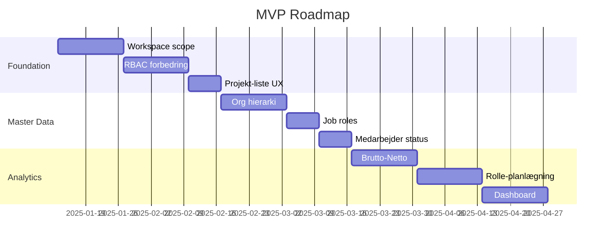

# MVP Roadmap: Projekt-Tool PMO

## Executive Summary

PRD indeholder 7 moduler med ~35 features. Baseret på nuværende implementation og dependencies anbefales opdeling i 3 faser.

---

## Nuværende Implementation (Baseline)

| Feature | Status |
|---------|--------|
| User roles | ✅ Admin, Projektleder, Teammedlem |
| Locations | ✅ 5 hardcoded (Sano Aarhus/Middelfart/Skælskør, Dansk Gigthospital, Sekretariatet) |
| Employee capacity | ✅ maxCapacityHoursWeek |
| Projects | ✅ CRUD, status (active/hold/completed) |
| Project members | ✅ Med timeregistrering |
| Reports | ✅ Ugebaseret med risici, faser, milestones |
| Resource analytics | ✅ Kapacitet vs. planlagt/faktisk |

---

## MVP 1.0 - Foundation (4-6 uger)

> [!IMPORTANT]
> Fokus: Basis multi-workspace + forbedret RBAC + UX

### 1.1 Workspace Foundation
| Feature | Complexity | PRD Ref |
|---------|------------|---------|
| `workspace_id` på alle entiteter | Medium | 1 |
| Workspace-tabel (id, name, type) | Low | 1 |
| Bruger-workspace relation | Low | 1 |
| Data isolation i queries | Medium | 1 |

**Database ændringer:**
```sql
CREATE TABLE workspaces (id UUID, name TEXT, type TEXT);
ALTER TABLE projects ADD workspace_id UUID;
ALTER TABLE employees ADD workspace_id UUID;
ALTER TABLE users ADD workspace_id UUID;
```

### 1.2 Forbedret RBAC
| Feature | Complexity | PRD Ref |
|---------|------------|---------|
| Ny rolle: "Mellemleder" (PMO) | Low | 2 |
| PL read-all, write-own | Medium | 2 |
| Projektleder-felt på projekt | Low | 2 |

### 1.3 Projekt-liste UX
| Feature | Complexity | PRD Ref |
|---------|------------|---------|
| Default filter: kun "Aktiv" | Low | 3 |
| "Mine Projekter" sektion | Medium | 3 |
| Status-filter toggle | Low | 3 |

**Estimat:** 4-6 uger | **Risiko:** Lav-Medium

---

## MVP 1.5 - Master Data (3-4 uger)

> [!TIP]
> Fokus: Organisationshierarki + roller + status

### 1.5.1 Organisationshierarki
| Feature | Complexity | PRD Ref |
|---------|------------|---------|
| Organisation-tabel | Low | 4 |
| Location-tabel (erstatter hardcoded) | Medium | 4 |
| Afdeling/Team-tabel | Low | 4 |
| Hierarki: PMO → Org → Lok → Afd | Medium | 4 |

### 1.5.2 Job Roles (Master Data)
| Feature | Complexity | PRD Ref |
|---------|------------|---------|
| Rolle-tabel (Sygeplejerske, etc.) | Low | 4 |
| Medarbejder → Rolle relation | Low | 4 |

### 1.5.3 Medarbejder Status
| Feature | Complexity | PRD Ref |
|---------|------------|---------|
| Aktiv/Inaktiv felt | Low | 4 |
| Orlovsperioder | Medium | 4 |
| Tidskategorisering (%) | Medium | 4 |

**Estimat:** 3-4 uger | **Risiko:** Lav

---

## MVP 2.0 - Analytics Engine (4-6 uger)

> [!WARNING]
> Fokus: Avanceret ressourcestyring - kræver MVP 1.5

### 2.0.1 Brutto-til-Netto
| Feature | Complexity | PRD Ref |
|---------|------------|---------|
| Baseline kapacitet | ✅ Eksisterer | 5 |
| Fradrag (drift, ferie, compliance) | High | 5 |
| Netto projekt-tid beregning | High | 5 |

### 2.0.2 Rolle-baseret Planlægning
| Feature | Complexity | PRD Ref |
|---------|------------|---------|
| "Generic resource" på projekt | High | 5 |
| Rolle-kapacitet aggregering | High | 5 |
| Flaskehals-detektor på roller | High | 5 |

### 2.0.3 Dashboard Forbedringer
| Feature | Complexity | PRD Ref |
|---------|------------|---------|
| Projekt-filter i grafer | Medium | 6 |
| 85% threshold linje | Low | 6 |
| Overbooking highlighting | Medium | 6 |
| Drill-down (Org → Lok → Afd) | High | 6 |

**Estimat:** 4-6 uger | **Risiko:** Høj

---

## Backlog (Post-MVP)

| Feature | PRD Ref | Priority |
|---------|---------|----------|
| Dokumenthåndtering | 3 | Medium |
| Sprint/Agil proces | 7 | Low |
| Notifikationsmodul | 7 | Medium |
| KPI vs. strategiske mål | 6 | Medium |

---

## Anbefalet Rækkefølge



---

## Beslutninger Påkrævet

1. **Workspace strategi:** Database-level isolation (strikt) eller logical separation (fleksibel)?
2. **Tidskategorisering:** Skal alle 4 kategorier (Udvikling/Drift/Compliance/Forskning) bruges af begge workspaces?
3. **Generic resources:** Skal rolle-baseret planlægning ind i MVP 1.5 eller 2.0?
