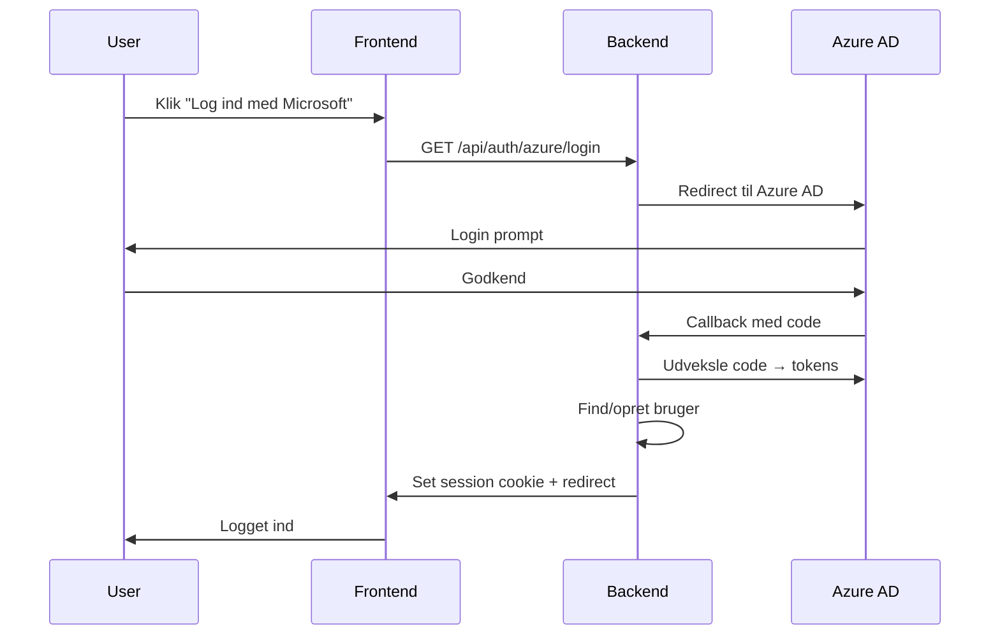

# Fase 2: Azure AD SSO Login

> [!NOTE]
> **Afhænger af:** Fase 1 (Password Reset) ✅ og Azure App Registration med OIDC-konfiguration.

## Formål
Tilføj "Log ind med Microsoft" knap til login-siden, så Azure AD brugere kan logge ind via SSO.

---

## User Review Required

> [!IMPORTANT]
> **Azure App Registration udvidelse:** Kræver `openid`, `profile`, `email` scopes + redirect URI konfiguration.

> [!WARNING]
> **Redirect URI:** Skal konfigureres i Azure AD (f.eks. `http://localhost:5173/auth/callback`).

---

## Proposed Changes

### Configuration

#### [MODIFY] backend/config/index.js
```javascript
AZURE_OIDC_REDIRECT_URI: z.string().url().optional(),
```

---

### Backend

#### [NEW] backend/services/azureAuthService.js
- `getAuthorizationUrl()` - Generer Azure AD login URL
- `handleCallback(code)` - Udveksle code til tokens, opret/find bruger
- `validateIdToken(token)` - Verificer og decode Azure ID token

#### [NEW] backend/routes/azureAuthRoutes.js
```javascript
GET /api/auth/azure/login      → Redirect til Azure AD
GET /api/auth/azure/callback   → Modtag code, opret session
```

#### [MODIFY] backend/repositories/usersRepository.js
```javascript
export const findOrCreateByAzureId = async (client, { azureId, email, name }) => { ... };
```

---

### Database Migration

#### [NEW] backend/migrations/YYYYMMDD_add_azure_id.js
```javascript
pgm.addColumn('users', {
  azure_oid: { type: 'text', unique: true },  // Azure Object ID
});
pgm.createIndex('users', 'azure_oid');
```

---

### Frontend

#### [MODIFY] LoginPage.tsx
```tsx
<button onClick={() => window.location.href = '/api/auth/azure/login'}>
  Log ind med Microsoft
</button>
```

#### [NEW] src/app/pages/auth/AuthCallbackPage.tsx
- Håndter redirect fra Azure AD
- Vis loading/success/error state

---

## Flow Diagram



---

## Verification Plan

### Automated Tests
- Unit test for token validation
- Integration test for callback endpoint

### Manual Testing
1. Klik "Log ind med Microsoft" → Azure AD login
2. Godkend → Redirect til dashboard
3. Verificer `auth_provider = 'azure_ad'` i database
