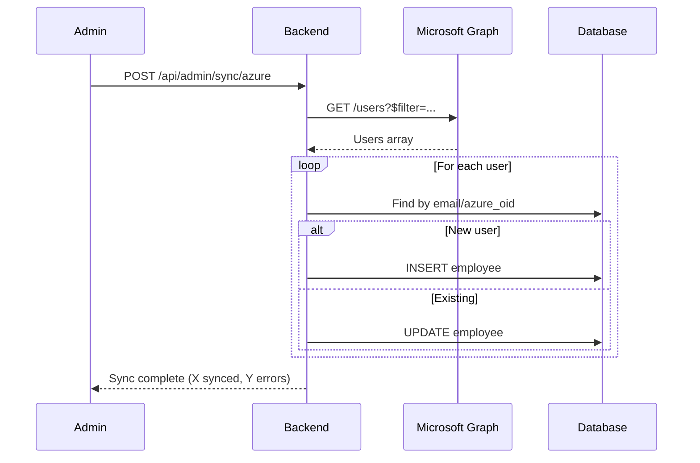

# Fase 3: Azure AD Bruger/Medarbejder Sync

> [!NOTE]
> **Afhænger af:** Fase 2 (Azure AD SSO) ✅ for at genbruge Azure autentificering.

## Formål
Automatisk synkronisering af medarbejdere fra Azure AD til `employees`-tabellen, så organisationens brugere automatisk oprettes/opdateres.

---

## User Review Required

> [!IMPORTANT]
> **Azure API Permission:** Kræver `User.Read.All` (application permission) + admin consent.

> [!WARNING]
> **Konfliktløsning:** Eksisterende employees med matchende email skal merges, ikke duplikeres.

---

## Proposed Changes

### Configuration

#### [MODIFY] backend/config/index.js
```javascript
AZURE_SYNC_ENABLED: booleanSchema.default(false),
AZURE_SYNC_FILTER: z.string().optional(),  // OData filter for users
```

---

### Backend

#### [NEW] backend/services/azureSyncService.js
```javascript
export const syncAllUsers = async () => { ... };
export const syncSingleUser = async (azureOid) => { ... };
export const getAzureUsers = async (filter) => { ... };
```

**Sync-logik:**
1. Hent brugere fra Graph API (`/users?$filter=...`)
2. For hver bruger:
   - Find employee by email ELLER azure_oid
   - Opret ny / opdater eksisterende
   - Sæt `azure_oid`, `azure_synced_at`
3. Marker inaktive brugere (valgfrit)

#### [NEW] backend/repositories/employeeSyncRepository.js
```javascript
export const findByAzureOid = async (client, azureOid) => { ... };
export const upsertFromAzure = async (client, { azureOid, email, name, department, location }) => { ... };
export const markSyncedAt = async (client, employeeId) => { ... };
```

#### [NEW] backend/routes/syncRoutes.js
```javascript
POST /api/admin/sync/azure    → Kør manuel sync (admin only)
GET  /api/admin/sync/status   → Hent sync-status
```

---

### Database Migration

#### [NEW] backend/migrations/YYYYMMDD_add_employee_azure_fields.js
```javascript
pgm.addColumn('employees', {
  azure_oid: { type: 'text', unique: true },
  azure_synced_at: { type: 'timestamptz' },
});
pgm.createIndex('employees', 'azure_oid');
```

---

### Frontend (Admin Panel)

#### [NEW] src/app/pages/admin/AzureSyncPanel.tsx
- Vis sync-status og sidste sync-tidspunkt
- "Synkroniser nu" knap
- Liste over synkroniserede medarbejdere
- Konflikthåndtering UI

---

## Sync Flow Diagram



---

## Matching Strategy

| Prioritet | Match på | Handling |
|-----------|----------|----------|
| 1 | `azure_oid` | Opdater eksisterende |
| 2 | Email (case-insensitive) | Link til Azure + opdater |
| 3 | Ingen match | Opret ny employee |

---

## Verification Plan

### Automated Tests
- Unit test for matching-logik
- Integration test for sync endpoint

### Manual Testing
1. Admin panel → klik "Synkroniser"
2. Verificer nye employees oprettes
3. Ændr brugerdata i Azure AD → kør sync → verificer opdatering
4. Test konfliktløsning (eksisterende email)
